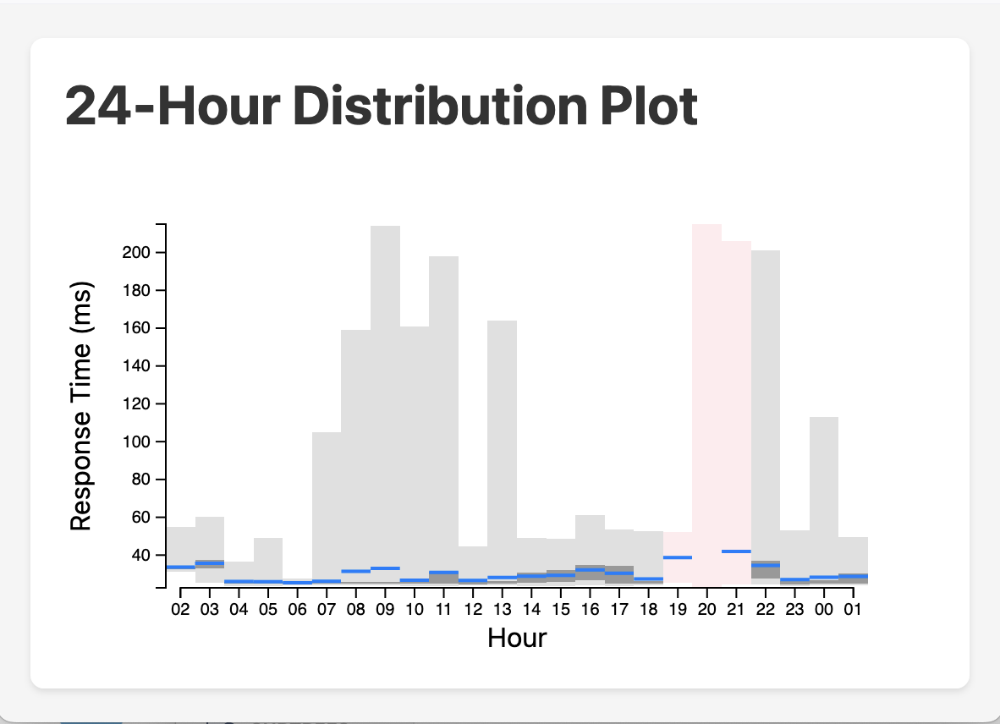

# Smokechart 

Plot rows of data into columns in a "smoke chart" style.
Indicate the mean/average with a blue line;
25 to 75 percentiles in dark grey;
light grey indicates the full range of the data values.

The intended use is to plot the ping response times over time.
Each vertical bar represents a one-hour period
(likely 120 samples, from 30-second intervals).
Display only the most recent 24 hours.

If data samples are missing (say, the network was down),
tint the entire column with red.
Hours where there were valid data samples show the mean/average
with the blue bar.

The basics of this Javascript were generated
by a friendly session with Claude.ai.

## Sample chart



## Data representation

The data provided to the chart function is an array of arrays.
Each individual array consists of an arbitrary number of samples:
the array "row" represents one hour of samples.
Missing samples are represented as NaN or "0/0" in the array.

The _pings2.json_ file has actual data.

## Testing

```bash
cd smokechart
browser-sync start --server --files "css/*.css" "*.js*" "*.html" "*.md"
```

